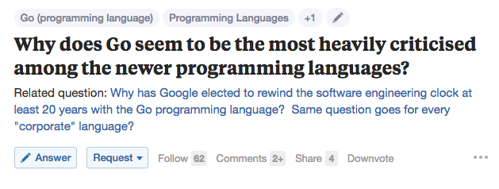
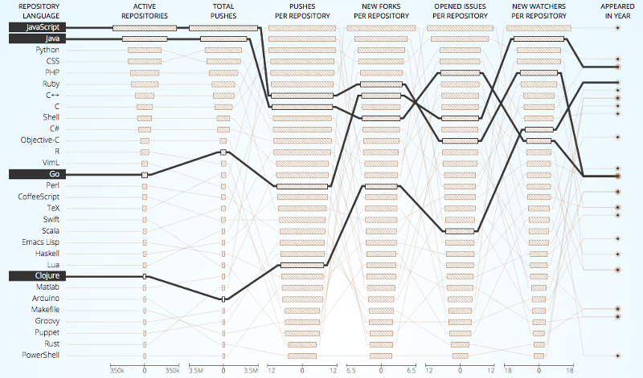
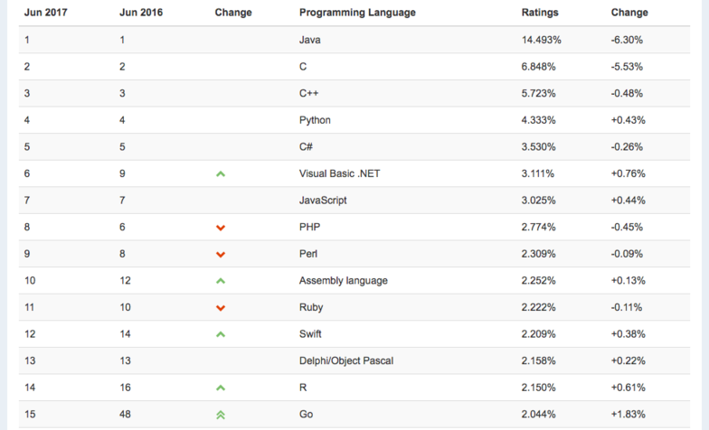
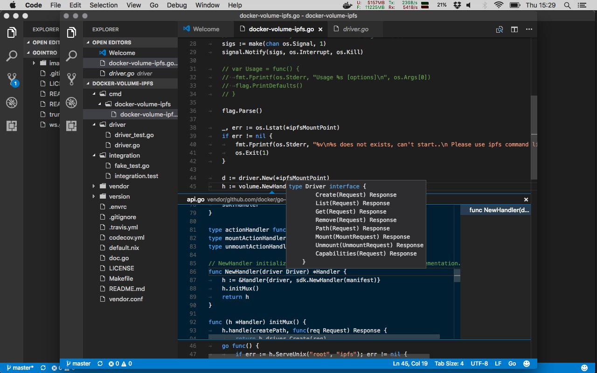

Hello Golang
============

A modern programming language
-----------------------------

[Martin Czygan](mailto:martin.czygan@gmail.com)
Gopher
June 8, 2017 18:00 CEST
[jenadevs](https://www.meetup.com/jenadevs/) meetup at [Friedrich-Schiller-Universität Jena](https://www.uni-jena.de/)

----

About me
========

* Gopher since 2013
* Programmer at [Leipzig University Library](https://www.ub.uni-leipzig.de/ueber-uns/stellenausschreibung-ausbildung-praktikum/aktuelle-stellenausschreibungen/)
* Co-Author of [Getting Started with Python Data Analysis](https://www.amazon.com/gp/product/1785285114)
* Consultant
* Trainer at [Python Academy](http://www.python-academy.com/)

----

About me
========

Open source projects: [esbulk](https://github.com/miku/esbulk), [solrbulk](https://github.com/miku/solrbulk), [microblob](https://github.com/miku/microblob), [gluish](https://github.com/miku/gluish), [metha](https://github.com/miku/metha), [marctools](https://github.com/ubleipzig/marctools).

Presentations at [LPUG](https://twitter.com/lpyug) about [pandas](http://pandas.pydata.org/), [luigi](https://github.com/spotify/luigi), [neural nets](https://github.com/miku/nntour).

Workshop on Go interfaces at [Golab](golab.io), an European Go conference in Italy.

----

My language log
===============

BASIC, Pascal, Perl, *Bash*, Ruby, *Java*, *C*, C++, *PHP*, *JavaScript*, *Python*, *Go*.

----

Outline
=======

First: slides

* Go: its users and critics, language constructs
* Go and OO, Go and Concurrency
* The Go development workflow

Then: hands-on, if you want:

- Get Go installed
- Write a simple (web service | concurrent program) in Go

----

Question: Is Go a modern language?
==================================

[](https://www.quora.com/Why-does-Go-seem-to-be-the-most-heavily-criticised-among-the-newer-programming-languages?srid=uCiY&share=1)

[](https://twitter.com/Grazfather/status/861077467770925056][861077467770925056)

----

GitHub Activity (2016)
======================

From [GoLang or the future of the dev](https://hackernoon.com/golang-or-the-future-of-the-dev-984c2f145bbe):



----

TIOBE
=====

From [June 2017](https://www.tiobe.com/tiobe-index/):



----

Golang is trash
===============

[Golang is trash (2014)](http://dtrace.org/blogs/wesolows/2014/12/29/golang-is-trash/):


[github.com/ksimka/go-is-not-good](https://github.com/ksimka/go-is-not-good) (1233 stars):


----

Why is Go not good?
===================


----

Why is Go not good?
===================


----

Why is Go not good?
===================

The list goes on and on:

* designed for stupid people
* no OOP
* no exceptions
* no versioning model
* too opinionated
* too simple

----

So, why do I use it?
====================

- I was curious about Ken Thompsons' [experiment](http://www.drdobbs.com/open-source/interview-with-ken-thompson/229502480).
- I like production code and low operational overhead (e.g. install, maybe config, run).
- With Go, I mostly think about the problem, not about the language.

----

A small language
================

* 25 keywords

```
break        default      func         interface    select
case         defer        go           map          struct
chan         else         goto         package      switch
const        fallthrough  if           range        type
continue     for          import       return       var
```

----

Hello World
===========

<!-- package, import, func -->

```
package main

import "fmt"

func main() {
    fmt.Println("Hello 세계")
}
```

[Play](https://play.golang.org/p/RbRaHH666y).

----

Declaring variables
===================

<!-- var -->

```
package main

import (
    "fmt"
    "time"
)

var timeout time.Duration
var N = 4

func main() {
    n, k := N, 2.0
    fmt.Printf("n=%d, k=%0.3f, timeout=%s", n, k, timeout)
}
```

[Play](https://play.golang.org/p/mXPQGN-9qa).

----

Visibility
==========

* Lowercase private, uppercase public

----

Every type has a zero value
===========================

```
package main

import "fmt"

func main() {
    var a float64
    var b int16
    var c string
    fmt.Printf("a=%v, b=%v, c=%v, len(c)=%v",
        a, b, c, len(c))
}
```

[Play](https://play.golang.org/p/9CTQIYZpfV).

----

Various numberic types
======================

```
type                                 size in bytes

byte, uint8, int8                     1
uint16, int16                         2
uint32, int32, float32                4
uint64, int64, float64, complex64     8
complex128                           16
```

* https://golang.org/pkg/builtin/

----

Basic types
===========

```
bool

string

int  int8  int16  int32  int64
uint uint8 uint16 uint32 uint64 uintptr

byte // alias for uint8

rune // alias for int32
     // represents a Unicode code point

float32 float64

complex64 complex128
```

----

Only one loop construct
=======================

<!-- const, for (break, continue) -->

```
package main

import "fmt"

const Prefix = ">> "

func main() {
    for i := 0; i < 5; i++ {
        log.Printf("%s %0d", Prefix, i)
    }
}
```

[Play](https://play.golang.org/p/JCU7dCioih). Break, continue as you expect.

----

Slices
======

<!-- range -->

```
package main

import "fmt"

func main() {

    cities := []string{"Jena", "Weimar", "Erfurt"}

    for i, city := range cities {
        fmt.Println(i, city)
    }
}
```

----

Functions
=========

<!-- func, return -->

```
package main

import "fmt"

func Hello(name string) (string, error) {
	if len(name) < 2 {
		return "", fmt.Errorf("name too short")
	}
	return fmt.Sprintf("Hello %s", name), nil
}

func main() {
    greeting, err := Hello("a")
    fmt.Println(greeting, err)
}
```

[Play](https://play.golang.org/p/56URr2CuhG).

----

If needs no parentheses
=======================

<!-- if -->

```
package main

import "log"

func main() {
    a, b := 4, 3
    if a < b {
        log.Println("a smaller b")
    } else {
        log.Println("a not smaller b")
    }
}
```

[Play](https://play.golang.org/p/-cSfWZB9aE).

----

Keywords to go (13)
===================

```
        default              interface    select
case    defer         go     map          struct
chan                  goto                switch
        fallthrough                       type
```

----

Braching with switch, case and default
======================================

```
package main

import "fmt"

func main() {
    s := "A"
    switch s {
    case "A":
        fmt.Println("a")
    case "B":
        fmt.Println("b")
    default:
        fmt.Println("?")
    }
}
```

[Play](https://play.golang.org/p/b6W-U_U1ej).

----

Fallthrough
===========

* A design mistake correction from the C language


----

Fallthrough
===========

* Example, [ascii85](https://golang.org/src/encoding/ascii85/ascii85.go#L43)

```
var v uint32
switch len(src) {
default:
    v |= uint32(src[3])
    fallthrough
case 3:
    v |= uint32(src[2]) << 8
    fallthrough
case 2:
    v |= uint32(src[1]) << 16
    fallthrough
case 1:
    v |= uint32(src[0]) << 24
}
```

[Play](https://play.golang.org/p/2kM64T9iKB).

----

Keywords to go (9)
==================

```
                             interface    select
        defer         go     map          struct
chan                  goto
                                          type
```

----

Defer
=====

* Defer is wonderful.

```
package main

func f() error {
    defer fmt.Println("exiting f")
    if rand.Float64() > 0.5 {
        fmt.Println("f failed")
    }
    return nil
}

func main() {
    f()
}
```

[Play](https://play.golang.org/p/PaAVy-m0eL).

----

Defer
=====

* Use cases: closing file, connections, response bodies, profiling
* make code much more readable, but has performance implications

----

Keywords to go (8)
==================

```
                             interface    select
                      go     map          struct
chan                  goto
                                          type
```

----

Keywords to go (7)
==================

```
                             interface    select
                      go     map          struct
chan
                                          type
```


----

Hashmaps
========

```
package main

import "fmt"

func main() {
	m := map[string]string{
		"Meetup":   "jenadevs",
		"Location": "FSU Jena",
	}
	fmt.Println(m)
}
```

[Play](https://play.golang.org/p/45ePPvtuP9).

----

Keywords to go (6)
==================

```
                             interface    select
                      go                  struct
chan
                                          type
```

* Concurrency: go, chan, select
* OO: type, struct, interface

----

OO in Go
========

* no classes
* composition over inheritance
* small interfaces
* no explicit declarations

----

Custom types
============

* before we see compound types, let's look at something simpler

----

Custom types
============

<!-- type -->

```
package main

import "fmt"

type Celsius float64

func main() {
	var temp Celsius
	fmt.Printf("below %v degree", temp)
}
```

[Play](https://play.golang.org/p/ENCcULL9zE).

----

Functions on custom types
=========================

```
package main

import "fmt"

type Celsius float64

func (c Celsius) String() string {
    return fmt.Sprintf("%0.1f°", c)
}

func main() {
    var temp Celsius
    fmt.Printf("below %s degree", temp)
}
```

----

Compound types
==============

```
package main

import "fmt"

type Meetup struct {
	Name     string
	Location string
}

func main() {
    meetup := Meetup{
        Name:     "jenadevs",
        Location: "FSU Jena",
    }
    fmt.Printf("%+v", meetup)
}
```

[Play](https://play.golang.org/p/7gls5_rWLa).

----

Compound types ([play](https://play.golang.org/p/eKMVv59sfI))
==============

```
package main

import "fmt"

type Address struct {
	City   string
	Street string
}

type Meetup struct {
	Name     string
	Location Address
}

func main() {
	meetup := Meetup{"jenadevs", Address{
		Street: "Fürstengraben 1",
		City:   "Jena"}}
	fmt.Printf("%+v", meetup)
}
```

<!-- implement a method on the playground -->

----

Defining Methods on Types
=========================

```
type Client struct {
    scheme string
    host   string
    proto  string
    ...
}

...

func (cli *Client) ContainerList(...) (..., error) {
...
}

```

* [moby/client/client.go](https://github.com/moby/moby/blob/36db52a7049c0f00e75f7cfcbd5061dc7600180f/client/client.go#L67-L86)

* [moby/client/container_list.go](https://github.com/moby/moby/blob/f96d45dc8ac21db1f082230e2f828a86e15cad46/client/container_list.go#L14-L56)

----

Types
=====

* basic types (int, float, complex64, string, rune, byte, bool)
* slices (variable sized array)
* maps (hashmaps)
* struct types (compound types)

----

A few more types
================

A few more builtin types:

* array types (fixed size)
* pointer types (Pointers reference a location in memory where a value is stored rather than the value itself)
* function types (functions are first class objects)
* interface types
* channel types

----

Arrays
======

* rarely used

```
package main

import "fmt"

func main() {
    var v [3]int64
    fmt.Println(v)
}
```

[Play](https://play.golang.org/p/Yvggxjkg9-).

----

Pointers
========

```
package main

import "fmt"

func main() {
	var x = 42
	fmt.Printf("%v", &x)
}
```

[Play](https://play.golang.org/p/xP9M87xrBZ).

----

Pointers
========

```
package main

import "fmt"

func main() {
	x := new(int32)
	fmt.Printf("%T", x)
}
```

[Play](https://play.golang.org/p/A7i7TiDyhZ).

----

Pointers
========

You will see (use) pointer receivers on struct methods:

```
func (cli *Client) ContainerList ...
```

* required, if a method mutates values
* even, if it is just a single method, for consistency, all methods should use a pointer receiver

----

Function types
==============

* lots of fun
* closures

```
package main

import "fmt"

func main() {
	f := func(s string) string {
		return fmt.Sprintf("<%s>", s)
	}
	fmt.Println(f("functional"))
}
```

[Play](https://play.golang.org/p/nsMawA3PER).

----

Function types
==============

```
package main

type Converter func(string) string

func Convert(value string, f Converter) string {
	return f(value)
}

func main() {
	// ...
}
```

[Play](https://play.golang.org/p/UfgFjA71IP).

----

Function types
==============

```
type Converter func(string) string
```

Any function with the signature `func(string) string` will implement Converter.

----

Interface types
===============

* set of methods
* satisfied implicitly

----

Interface types
===============

```go
package main

type Starter interface {
    Start() error
}

type Container struct {
	ID string
}

func (c Container) Start() error {
    // ...
}
...
```

[Play](https://play.golang.org/p/59Si3Cjr8I).

----

Interface types
===============

> The bigger the interface, the weaker the abstraction.

----

Interface types
===============

* Go has small interfaces
* Example: [package io](https://golang.org/pkg/io/)

```
type Reader interface {
    Read([]byte) (n int, err error)
}

type Writer interface {
    Write([]byte) (n int, err error)
}

type ReadWriter interface {
    Reader
    Writer
}
```

----

Interface types
===============

Can small interfaces be useful?

* [Explore IO](https://github.com/miku/exploreio) workshop

----

IO
==

> ... satisfied implictly. But that's actually not the most important thing about Go's interfaces. The really most important thing is the culture around them that's captured by this proverb, which is that the smaller the interface is the more useful it is.

> io.Reader, io.Writer and the empty interface are the three most important interfaces in the entire ecosystem, and they have an average of 2/3 of a method.

----

Empty interface
===============

```
package main

import "fmt"

func main() {
    var x interface{}
    x = 5
    fmt.Printf("%v, %T\n", x, x)
    x = "Hello"
    fmt.Printf("%v, %T\n", x, x)
}
```

----

Type assertion
==============

```
package main

import "fmt"

func IsString(v interface{}) bool {
    _, ok := v.(string)
    return ok
}

func main() {
    fmt.Println(IsString(23))
    fmt.Println(IsString("23"))
}
```

[Play](https://play.golang.org/p/itZAM0UgCe).

----

Polymorphism
============

* via interfaces
* no explicit declaration

```
package main

import "fmt"

type Number struct{ x int }

func (n Number) String() string { return fmt.Sprintf("<Number %d>", n.x) }

func main() {
    five := Number{5}
    fmt.Println(five)
}
```

[Play](https://play.golang.org/p/UbhGsZqKUz).

----

Interface advantages
====================

* no dependence between interface and implementation
* easy testing
* avoids overdesign, rigid hierarchy of inheritance-based OO

> The source of all generality in the Go language. 

* https://talks.golang.org/2014/research.slide#20

(Requires some boilerplate, e.g. sort.Interface)

----


Concurrency
===========

* based on Communicating Sequential Processes (CSP), 1978
* avoids explicit locks

> Do not communicate by sharing memory; instead, share memory by communicating.

----

CSP
===

> In Hoare's CSP language, processes communicate by sending or receiving values from named unbuffered channels. Since the channels are unbuffered, the send operation blocks until the value has been transferred to a receiver, thus providing a mechanism for synchronization.


----

Concurrency
===========

Three elements:

* goroutines
* channels
* select statement

----

Concurrency: goroutines
=======================

* the go keyword start a function in a separate lightweigth thread

----

Concurrency: goroutines
=======================

```
package main

import (
	"fmt"
	"time"
)

func f() {
	time.Sleep(1 * time.Second)
	fmt.Println("f")
}

func main() {
	go f()
	fmt.Println("main")
	time.Sleep(2 * time.Second)
	fmt.Println("main")
}
```

[Play](https://play.golang.org/p/MvhjfOjgzi).

----

Concurrency: goroutines
=======================

* easy to start (many)

```
package main

import (
	"fmt"
)

func main() {
	N := 1000
	for i := 0; i < N; i++ {
		go func() {
			x := 0
			x++
		}()
	}
	fmt.Println("done")
}
```

[Play](https://play.golang.org/p/8m61pgB3Kt).

----

Concurrency: channels
=====================

* How to communicate between goroutines: enter channels.
* Channels: typed conduits for synchronisation and communication

----

Concurrency: channels
=====================

```
package main

import "fmt"

func main() {
	ch := make(chan string)
	go func() {
		ch <- "Hello"
	}()
	fmt.Println(<-ch)
}
```

<!-- show deadlocks -->

----

Concurrency: channels
=====================

```
package main

// ...

func a(ch chan string) {
	for msg := range ch {
		fmt.Println(msg)
	}
}

func main() {
	ch := make(chan string)
	go a(ch)
	ch <- "Hello"
	ch <- "World"
	close(ch)
	time.Sleep(1 * time.Second)
}
```

[Play](https://play.golang.org/p/i6CM04Pe2m).


----

Channels
========

```
package main

import "fmt"

func main() {
    c := make(chan string)
    go func() {
        c <- "Hello"
        c <- "World"
    }()
    fmt.Println(<-c, <-c)
}
```

.

----

Select statement
================

* select statement is similar to a switch but works with channels

> The select statement lets a goroutine wait on multiple communication
operations. A select blocks until one of its cases can run, then it executes
that case.

----

Select statement
================

```
func main() {
	ch := make(chan int)
	go func() {
		select {
		case <-time.After(1 * time.Second):
			log.Fatal("timeout")
		case v := <-ch:
			log.Println(v)
			return
		}
	}()
	time.Sleep(1100 * time.Millisecond)
	ch <- 42
	time.Sleep(1 * time.Second)
}
```

[Play](https://play.golang.org/p/ZagSjRpAPZ).

----

Tooling
=======

Commonly referred to a the Go tool. It runs code (compiles to a temporary file):

```
$ go run main.go
```

----

Tooling
=======

Before you build code:

```
$ go fmt main.go
```

Or use: `goimports` - you favorite editor will have suitable plugins.

----


Tooling
=======

Build binary:

```
$ go build -o prog main.go
```

Cross complilation is easy.

----


Tooling
=======

Testing:

```
$ go test ./...
```

Testing and Benchmark helpers included.

----

Tooling
=======

Testing:

```
$ go vet ./...
```

Testing and Benchmark helpers included.

----

Tooling
=======

Get additional libraries:

```
$ go get github.com/fatih/structs
```

Dependency management is not great yet.

----

Standard library
================

* net/http
* flag
* io
* xml, json
* archive

----

Cool Projects
=============

* docker, k8s
* [NES simulator](https://github.com/fogleman/nes)
* https://github.com/gizak/termui
* https://github.com/peco/peco
* https://github.com/coreos/etcd
* https://github.com/chrislusf/seaweedfs
* https://github.com/minio/minio
* http://nsq.io/

----

Web frameworks
==============

* gorilla
* echo
* ...

----

More to learn
=============

* ref/spec, efficient go, blog, tour
* videos, gophercons, dotgo
* books, tutorials

----

Docker API
==========

List containers, create or remove them:

* https://gist.github.com/miku/db09463fb5637a987e3f6dce8f2e839d

----

Docker API
==========

```
$ go run create.go
2017/06/08 15:31:47 Pulling from library/alpine
2017/06/08 15:31:47 Digest: sha256:0b94d1d1b5e ..
2017/06/08 15:31:47 Status: Image is up to date ..
2017/06/08 15:31:47 created: 0b2a66483 ...

hello world
2017/06/08 15:31:49 removing: 0b2a66483067c520b761 ...
```

----

Docker API
==========

```
$ go run list.go
sha256:a298d5ca31220b888b5 ...
sha256:a41a7446062d197dd4b ...
```

----

Docker Volume API
=================



----

Docker Plugins API
==================

* https://docs.docker.com/engine/extend/plugin_api/

Example:

* https://github.com/vieux/docker-volume-sshfs

----

Go vs Python
============

* https://gist.github.com/miku/f7ac5873f6a29a096fde

----

Workshop
========

* http://localhost:6060/doc/install
* http://localhost:6060/doc/code.html

----

Workshop Examples
=================

* hello world  (1)
* request a web page (2)
* request a list of web pages (3)
* concurrently request a list of web pages (4)
* simple web service (5)

----

Workshop (1)
============

Set `$GOPATH` to `~/go`.

```
$ mkdir $GOPATH/src/github.com/user/hello
```

Create a file called `hello.go` - insert code, save, run.

----

Workshop (2)
============

* request a web page with `http.Get`

----

Workshop (3)
============

* request a list of web pages

----

Workshop (4)
============

* concurrently request a list of web pages

----

Workshop (5)
============

* various servers
